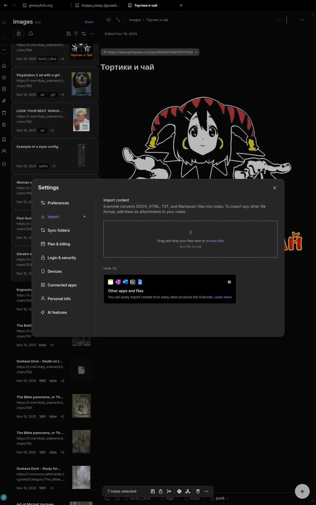
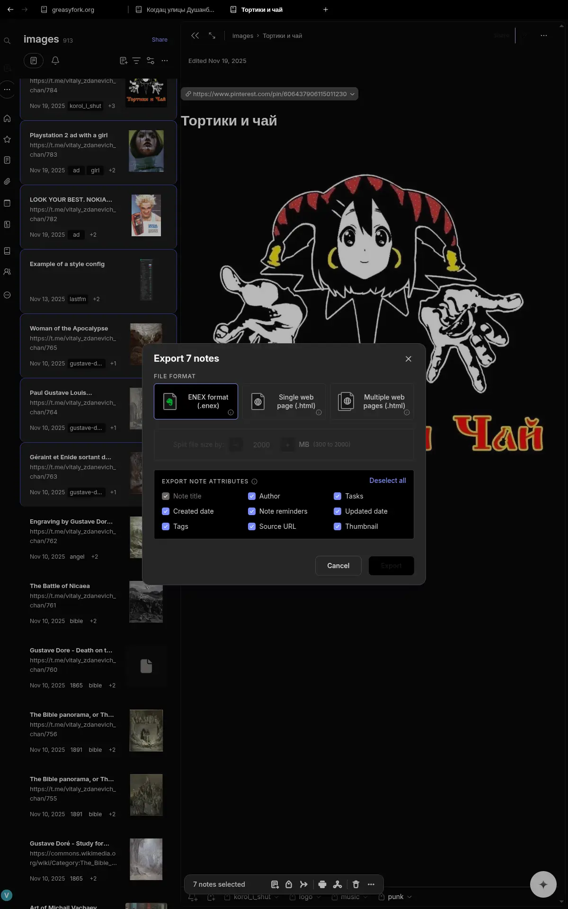

# evernote-linux-repackage

This project repackages the official Evernote Windows Electron client as a native Linux Electron bundle. It does not use Wine.

This is an unofficial community project. It is not affiliated with, endorsed by, or supported by Evernote or Bending Spoons. Evernote is a trademark of its respective owner. The official Evernote client is proprietary software, and redistributing rebuilt binaries may be subject to Evernote's license and trademark terms.

The current Windows installer is an NSIS archive containing an Electron app. The app itself is mostly portable, but the Windows package includes several native `.node` modules compiled for Windows. The build script replaces those with Linux builds and runs the app with the matching Linux Electron runtime.

## Status

Tested manually with Evernote `11.20.2` from `https://win.desktop.evernote.com/builds/Evernote-latest.exe`:

- Electron payload detected: `37.6.0`
- Main process starts under Linux Electron
- Conduit Core starts and opens [SQLite](https://en.wikipedia.org/wiki/SQLite) databases
- Login window loads and builds an OAuth request with `os_platform=linux`
- No Wine is involved

This is a repackaging port, not a source port. Evernote may change the installer layout or native dependencies in future releases.

Evernote's bundled auto-updater and in-app force-update checks are disabled by the build patcher. Updates for this port should come from rebuilt artifacts or AppImage releases from this project, not from Evernote's own desktop updater.

If you use Evernote on Linux, consider writing to Evernote and asking for an official Linux desktop client. This project is also a practical confirmation that the current Electron-based desktop app can run on Linux with Linux-native Electron and rebuilt native modules.

## Screenshots





## Differences From Evernote Web

This project runs Evernote's desktop client code. Compared with Evernote Web, it provides these desktop app workflows:

- Offline/local database support. The desktop app stores synced notes and notebooks in a local database for offline access. This Linux repackage uses the same Conduit/[SQLite](https://en.wikipedia.org/wiki/SQLite) desktop storage layer, but attachments are still lazy-loaded in practice and should not be assumed to be fully downloaded ahead of time. See [offline notes](https://help.evernote.com/hc/en-us/articles/209005917-Access-notes-offline).
- ENEX/HTML export. Note and notebook export is a desktop-app feature, not an Evernote Web feature. See [Export Notes and Notebooks as ENEX or HTML](https://help.evernote.com/hc/en-us/articles/209005557-Export-Notes-and-Notebooks-as-ENEX-or-HTML).
- ENEX import and file import workflows. ENEX import is handled by the desktop app; Evernote Web does not provide the same ENEX restore workflow. Desktop file import also supports content from other apps. See [How To: Import Notes and Notebooks](https://help.evernote.com/hc/en-us/articles/360035153274-How-To-Import-Notes-and-Notebooks) and [Import content from other apps into Evernote](https://help.evernote.com/hc/en-us/articles/208314308-Import-content-from-other-apps-into-Evernote).
- Sync folders. The desktop app can watch local folders and automatically import files placed there. See [Sync your local folders](https://help.evernote.com/hc/en-us/articles/209004967-Sync-your-local-folders-former-Import-Folder-feature).
- Desktop keyboard shortcuts. The desktop app has a full shortcut set. Evernote Web can be helped with a userscript such as [evernote/hotkey](https://gitlab.com/vitaly-zdanevich-userscripts/evernote/hotkey), but this repackage uses the desktop shortcut surface. See [Keyboard shortcuts](https://help.evernote.com/hc/en-us/articles/34296687388307-Keyboard-shortcuts).
- Right-click context menus. Desktop workflows use native-style context menus for actions such as export, encrypted text actions, shortcuts, and tab controls.
- Encrypted text workflow from the desktop context menu. This is not strictly desktop-only because Evernote Web also supports encrypting selected text with shortcuts, but the desktop app exposes the documented right-click workflow. Evernote only encrypts selected text, not whole notes or notebooks. See [Encrypt text in a note](https://help.evernote.com/hc/en-us/articles/209005547-Encrypt-text-in-a-note).
- Black minimal theme integrated, similar to https://gitlab.com/vitaly-zdanevich-styles/evernote

## Requirements

- Linux x86_64 or arm64
- Node.js 24 or newer, with npm 11 or newer
- `curl`
- `7z`
- `unzip`
- C/C++ build tools: `gcc`, `g++`, `make`
- `pkg-config`
- libsecret development headers, for building `keytar`
- A desktop Secret Service provider, such as GNOME Keyring or KWallet, for persistent login tokens

On Debian/Ubuntu-like systems the native build prerequisites are typically:

```bash
sudo apt install nodejs npm curl p7zip-full unzip build-essential pkg-config libsecret-1-dev
```

On Gentoo-like systems, make sure `app-arch/p7zip`, `net-misc/curl`, `app-arch/unzip`, `dev-util/pkgconf`, `app-crypt/libsecret`, and `gnome-base/gnome-keyring` are installed.

## Build

```bash
npm run build
```

By default, the build targets the host architecture. Supported targets are `x64`
and `arm64`. Native modules are compiled during the build, so an arm64 build
should run on an arm64 Linux host or CI runner:

```bash
TARGET_ARCH=arm64 npm run build
```

The default build follows Evernote's current Windows download URL. For a
checksum-pinned build, provide the expected installer checksum and versions:

```bash
EVERNOTE_URL=https://win.desktop.evernote.com/builds/Evernote-latest.exe \
EVERNOTE_SHA256=644c355ad53bbe5dbad93243458d52572f8c03715f83cca9ef1467af1341c4d6 \
EVERNOTE_EXPECTED_VERSION=11.20.2 \
ELECTRON_EXPECTED_VERSION=37.6.0 \
ELECTRON_SHA256=02e644d75392a1ea8991106bc77e1db243ee1fc0c23107dc3b253ed545dd4c66 \
npm run build
```

The portable app is written to:

```text
dist/Evernote-<version>-linux-<arch>
```

For convenience, the build also refreshes `dist/Evernote-linux-<arch>` as a symlink to the latest versioned directory and writes the exact paths to `dist/build-info.json`.

Run it with:

```bash
npm start
```

By default, the launcher uses Electron's `ELECTRON_DISABLE_SANDBOX=1` environment fallback and passes Chromium's `--no-sandbox` flag when `chrome-sandbox` is not installed as root-owned SUID. This keeps the portable bundle and AppImage working on normal desktop installs where a packaged SUID helper is not available.

For a real sandboxed install, set up Electron's sandbox helper:

```bash
sudo chown root:root dist/Evernote-linux-$(node -p 'process.arch')/chrome-sandbox
sudo chmod 4755 dist/Evernote-linux-$(node -p 'process.arch')/chrome-sandbox
```

Then run normally. To force the unsandboxed fallback, use `EVERNOTE_NO_SANDBOX=1`; to force sandbox mode, use `EVERNOTE_NO_SANDBOX=0`.

Run the app as your normal desktop user, not from a service/sandbox user. Login tokens use `keytar`, which maps to libsecret on Linux and needs a working user DBus/Secret Service session.

Closing the main Evernote window exits the Linux port instead of hiding it as a tray/background app. The patch still uses Evernote's normal `before-quit` cleanup path, so Conduit and window state cleanup can finish before the process exits.

If the window opens but the content area is blank or gray, try forcing software OpenGL:

```bash
EVERNOTE_DISABLE_GPU=1 npm start
```

## AppImage

After `npm run build`, prepare an AppDir without creating an AppImage:

```bash
npm run package:appimage -- --appdir-only
```

To build the final AppImage, provide `appimagetool`:

```bash
APPIMAGETOOL=/path/to/appimagetool npm run package:appimage
```

For reproducible packaging, use a pinned AppImage runtime too:

```bash
APPIMAGETOOL=/path/to/appimagetool \
APPIMAGE_RUNTIME_FILE=/path/to/runtime-x86_64 \
npm run package:appimage
```

Use the matching AppImage architecture name for arm64 packaging:
`APPIMAGE_ARCH=aarch64` with `runtime-aarch64`.

The AppImage is written to `dist/Evernote-<version>-x86_64.AppImage`. Packaging requires ImageMagick because Evernote ships its Linux-usable icon as an ICO file inside the Windows payload.
On arm64 builds, the AppImage is written to `dist/Evernote-<version>-aarch64.AppImage`.

The AppImage bundles `libsecret-1.so.0` because Evernote loads `keytar` during startup. A desktop Secret Service implementation, such as GNOME Keyring or KWallet, is still needed for login token storage.

Generate release checksums with:

```bash
npm run checksums
```

This writes `dist/SHA256SUMS`. Verify a downloaded release with:

```bash
sha256sum -c SHA256SUMS
```

## Tests And CI

Run local checks with:

```bash
npm run check
npm test
```

After `npm run build`, verify the generated Linux bundle before launching it:

```bash
npm run verify
```

The verifier checks that the rebuilt native modules used by the Linux port are ELF binaries, the expected bundle patches are present, and `main.js` still parses.

To inspect Chromium media MIME support in the pinned Electron runtime after a local build, run:

```bash
npm run check:media
```

After `npm run build`, run the startup smoke test with:

```bash
npm run smoke
```

The smoke test starts Evernote with a temporary profile under `xvfb-run`, waits for `Main app ready`, and fails if Evernote's updater endpoints are touched. Install `xvfb` locally, or run with `SMOKE_USE_XVFB=0` under an existing X display.

To smoke-test a built AppImage without relying on a FUSE mount, run:

```bash
APPIMAGE_EXTRACT_AND_RUN=1 \
EVERNOTE_SMOKE_EXECUTABLE=dist/Evernote-<version>-x86_64.AppImage \
npm run smoke
```

GitHub Actions is the CI for this project. The workflow runs local checks, unit tests, artifact verification, smoke tests, AppImage packaging, AppImage extract-and-run smoke tests, and checksum generation.

The GitHub Actions workflow has two build jobs:

- `build pinned` verifies the pinned Evernote installer SHA-256, expected Evernote version, expected Electron version, and Electron zip SHA-256. This is the only build used by GitHub releases.
- `build latest canary` follows Evernote's current `latest` installer. It runs on schedules, manual workflows, and tags; it is allowed to fail so a new upstream Evernote release does not block a pinned release.

Both build jobs compile native modules, run the smoke test on the unpacked bundle, build an AppImage, verify bundled AppImage runtime libraries, smoke-test that AppImage with `APPIMAGE_EXTRACT_AND_RUN=1`, run an x86_64 clean-container smoke test without host `libsecret`, write `dist/SHA256SUMS`, and upload architecture-specific artifacts for x86_64 and aarch64.

Tag workflows also run a GitHub `release` job. It publishes the pinned x86_64 and aarch64 AppImages, per-architecture `build-info-*.json` files, `SHA256SUMS`, release notes with the unofficial/proprietary redistribution warning, and GitHub artifact attestations.

## Troubleshooting

### Login Is Not Remembered

If Evernote asks you to log in again after restarting the app, the note database is usually not the problem. Account tokens are stored through `keytar`, which uses the Linux Secret Service/libsecret stack. The AppImage bundles `libsecret-1.so.0`, but the desktop must still provide and unlock a user keyring.

Check the basics:

```bash
printf '%s\n' "$DBUS_SESSION_BUS_ADDRESS"
busctl --user status org.freedesktop.secrets
```

If `DBUS_SESSION_BUS_ADDRESS` is empty, the app was not started inside a normal user desktop session. If `org.freedesktop.secrets` is missing or the command fails, install/start a Secret Service provider such as GNOME Keyring or KWallet.

You can also test secret storage with `secret-tool` when it is available:

```bash
secret-tool store --label='Evernote Linux test' app evernote-linux-repackage test login
secret-tool lookup app evernote-linux-repackage test login
```

The second command should print the stored value after the keyring is unlocked. If it cannot store or read the value, Evernote login tokens will not persist either.

Repeated "Unlock Keyring" prompts usually mean the desktop keyring is locked, not unlocked automatically by PAM/login, or was created with a different password than the user login password. Fix that in the desktop keyring manager before debugging the Evernote profile.

Do not run the AppImage with `sudo`, from a service, or from a different user account. That creates or reads a different DBus/keyring session and can make Evernote behave as if no token exists.

### Sync Looks Stuck

Evernote may lazy-download full note bodies and attachments, but after a successful login the note list, account state, logs, and Conduit [SQLite](https://en.wikipedia.org/wiki/SQLite) databases should still show activity. If the app has been open for a long time and notes do not appear, run:

```bash
npm run doctor
```

For a nonstandard profile location:

```bash
npm run doctor -- --profile /path/to/Evernote
```

The doctor command checks the Evernote profile, recent database writes, recent sync/auth/error log lines, running Evernote processes, and the DBus Secret Service state used for login tokens. Review the output before sharing it because logs may contain account or note metadata, even though common emails, UUIDs, and token-looking values are redacted.

If you only downloaded the AppImage and do not have the repository checkout, these commands show the most useful sync signals:

```bash
find ~/.config/Evernote/conduit-storage -type f -printf '%TY-%Tm-%Td %TH:%TM %9s %p\n' | sort | tail -30
find ~/.config/Evernote/logs -type f -name '*.log' -printf '%TY-%Tm-%Td %TH:%TM %9s %p\n' | sort | tail -20
```

If database files and logs stop changing while the app is open, sync is likely stuck before local storage writes. If logs show auth, token, keyring, `401`, or `403` errors, fix login/keyring first. If logs show `429` or server `5xx` responses, keep the redacted lines because that points to rate limiting or a server-side sync problem rather than AppImage packaging.

### FLAC Audio Does Not Play

The pinned Electron runtime reports `audio/flac` as playable, but not the older `audio/x-flac` MIME alias. The build patcher normalizes bundled runtime MIME metadata from `audio/x-flac` to `audio/flac` so FLAC attachments can be handed to Chromium's media element with a playable MIME type.

## Storage Notes

The desktop app uses [SQLite](https://en.wikipedia.org/wiki/SQLite) for its main local data layer through Evernote's Conduit packages:

- `better-sqlite3`
- `conduit-storage-better-sqlite3`
- `conduit-core`

Runtime data is not stored next to the AppImage or portable bundle. Electron stores it in the normal per-user application data directory:

```text
$XDG_CONFIG_HOME/Evernote
```

If `XDG_CONFIG_HOME` is unset, the default path is:

```text
~/.config/Evernote
```

The main Conduit [SQLite](https://en.wikipedia.org/wiki/SQLite) databases are under:

```text
~/.config/Evernote/conduit-storage/https%3A%2F%2Fwww.evernote.com/
```

Examples:

```text
_ConduitMultiUserDB.sql
LocalSettingsDB.sql
spidersense.sql
```

Other Electron app state is also stored below `~/.config/Evernote`, including `localsettings.json`, logs, cookies, Local Storage, Session Storage, and IndexedDB data. Cache data may also be written under `$XDG_CACHE_HOME/Evernote`, or `~/.cache/Evernote` when `XDG_CACHE_HOME` is unset.

Login secrets are handled by `keytar` through the Linux Secret Service/libsecret stack, so tokens may live in your desktop keyring rather than only in files under `~/.config/Evernote`.

## License

The source code, scripts, tests, CI configuration, and documentation in this repository are licensed under the MIT License. See `LICENSE`.

That license does not cover Evernote, Bending Spoons, Electron, appimagetool, or any other third-party software, trademarks, logos, icons, binaries, archives, installers, AppImages, or other proprietary materials downloaded, extracted, rebuilt, packaged, or referenced by this project. Those materials remain subject to their respective owners' licenses and terms.
